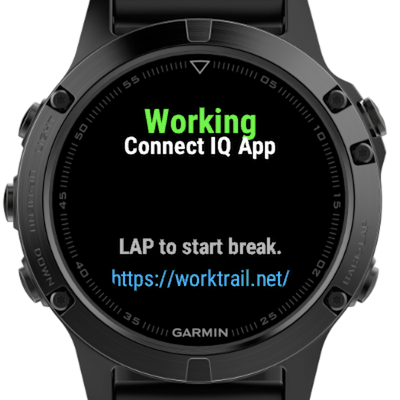

# worktrail-garmin-connect-iq

**Garmin Connect IQ App for WorkTrail**

Watch App for the time tracking web service WorkTrail. Requires the [free android app](https://play.google.com/store/apps/details?id=at.tapo.worktrail.android&referrer=utm_source%3Dgithub%26utm_medium%3Dworktrail-garmin-connect-iq%26utm_campaign%3Dworktrail-garmin-connect-iq) with a free account from https://worktrail.net/

WorkTrail makes time tracking easy and fun. Optimized for users and teams who work on multiple tasks throughout the day and have to keep track of which projects have taken up their time. Once time is recorded detailed statistics can be generated and exported as CSV or Excel document. Available as optimized Web Application and native as Android and iOS App.

## Requirements

* [Garmin Connect™ Mobile](https://play.google.com/store/apps/details?id=com.garmin.android.apps.connectmobile)
* Android app from the Google Play Store: [https://play.google.com/store/apps/details?id=at.tapo.worktrail.android](https://play.google.com/store/apps/details?id=at.tapo.worktrail.android&referrer=utm_source%3Dgithub%26utm_medium%3Dworktrail-garmin-connect-iq%26utm_campaign%3Dworktrail-garmin-connect-iq)
* A free WorkTrail account (Just register in the mobile app).

